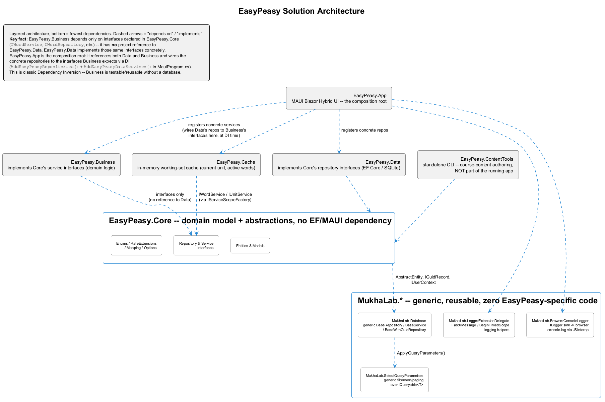
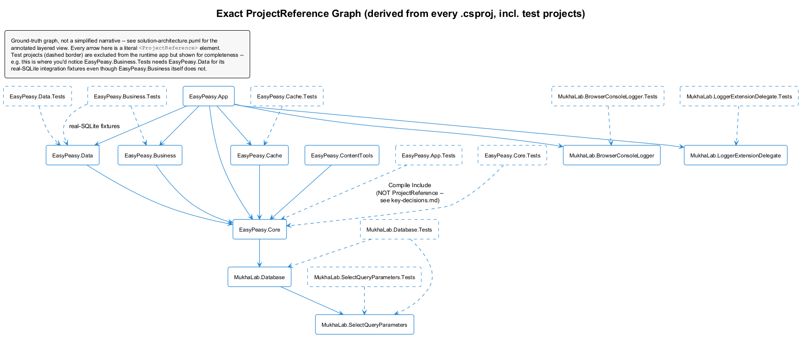
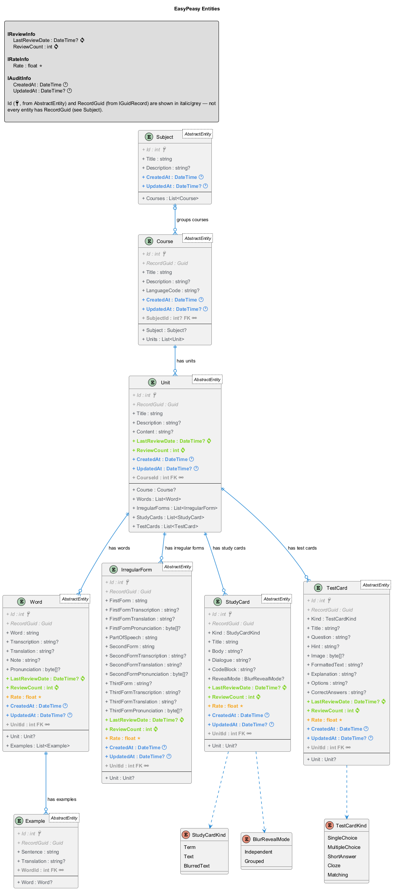
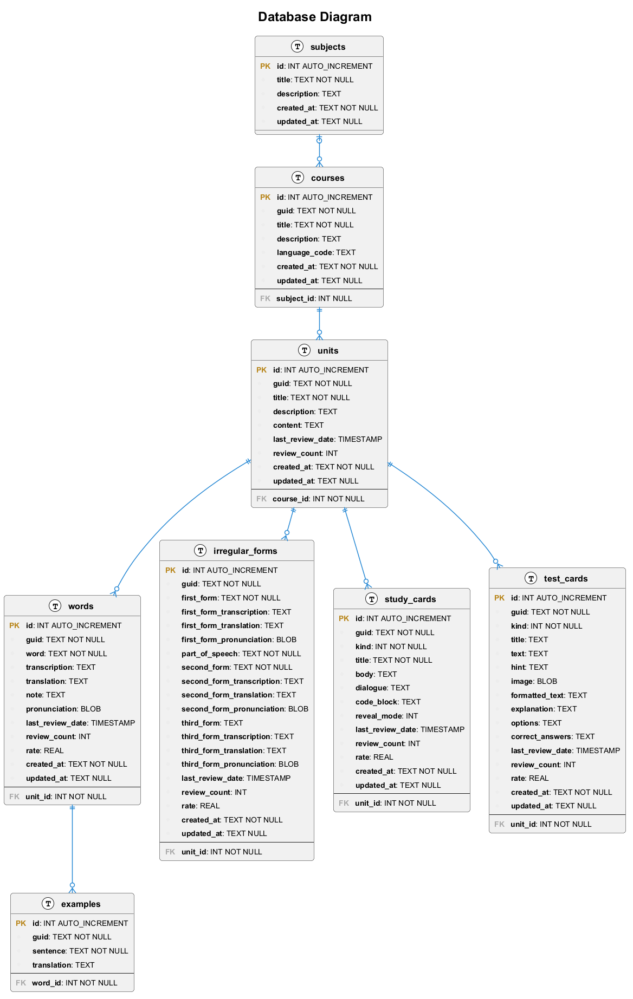

# EasyPeasy.Docs

Solution-wide documentation: architecture diagrams, developer guides, and the log of key
architectural decisions. Audience is **developers** working on or extending this solution — not
end users of the EasyPeasy app itself.

For what the app actually does — the content model, the practice session, the languages it is not
limited to — start from the [root README](../README.md); this project does not repeat it.

Per-project documentation (file-by-file breakdown, Known Issues, Testing sections) lives in each
project's own `README.md` and is linked from here rather than duplicated — this project is the map
and the "why," not a copy of the per-project detail.

## Start here

New to this solution? Read in this order:

1. **[Guides/getting-started.md](Guides/getting-started.md)** — prerequisites, clone, build, run,
   test.
2. **[Diagrams/solution-architecture.puml](Diagrams/solution-architecture.puml)** — the layered
   architecture, one diagram.
3. **[Guides/solution-structure.md](Guides/solution-structure.md)** — what each project is, with
   links to its own README.
4. **[Guides/conventions.md](Guides/conventions.md)** — naming/language/DI/testing conventions and
   known gotchas. Read this before your first PR.
5. **[Decisions/key-decisions.md](Decisions/key-decisions.md)** — why things are built the way they
   are, for the decisions most likely to look "wrong" until you know the history.

## Diagrams

Each diagram is kept as PlantUML source with a rendered PNG beside it, so it can be read here
without any tooling and still edited as text.

### Solution architecture

Layered architecture: `MukhaLab.*` infra → `Core` → `Data`/`Business` → `Cache` → `App`,
annotated with the Dependency Inversion pattern between Business, Data and App. Start here for
the big picture. Source: [solution-architecture.puml](Diagrams/solution-architecture.puml)



### Project dependencies

The exact `ProjectReference` graph, including test projects — ground truth, not a simplified
narrative. Source: [project-dependencies.puml](Diagrams/project-dependencies.puml)



### Entities

`EasyPeasy.Core` domain entities and their relationships.
Source: [entities.puml](Diagrams/entities.puml)



### Database

SQLite table and column layout. Source: [database.puml](Diagrams/database.puml)



### Re-rendering

After editing a `.puml`, regenerate its PNG so the two do not drift:

```bash
java -jar plantuml.jar -tpng -charset UTF-8 EasyPeasy.Docs/Diagrams/*.puml
```

PlantUML needs Java 11 or newer. The output is named after the diagram title inside the file, not
the file name, so rename the result to match its source.

Inside Visual Studio the "PlantUML Editor" extension does the same, but only with Render Type =
**Local** (Tools → Options → PlantUML → Advanced) — the default points at a dead demo server and
diagrams silently fail. See
[key-decisions.md #10](Decisions/key-decisions.md#10-plantuml-rendering-local-not-the-extensions-default-azure-demo-server).

## Guides

| File | Covers |
|---|---|
| [getting-started.md](Guides/getting-started.md) | Prerequisites, build, run, test — onboarding. |
| [solution-structure.md](Guides/solution-structure.md) | Every project, one paragraph each, linking to its own README. |
| [conventions.md](Guides/conventions.md) | Naming, language (code vs. UI text), exceptions, DI, testing, documentation conventions — and the gotchas that don't follow from reading any single file. |
| [entry-notation.md](Guides/entry-notation.md) | How a word or phrase is written so that one entry accepts every correct typing of it: `[]` optional parts, `{}` for a leading `a`/`an`/`the`/`to` that belongs to the entry, `/` alternatives, sb/sth placeholders. |
| [testing-strategy.md](Guides/testing-strategy.md) | The risk-based framework used to decide what to test in every project, plus a coverage summary (525 tests across 9 `.Tests` projects as of the last full run). |

## Decisions

[Decisions/key-decisions.md](Decisions/key-decisions.md) — a lightweight ADR log. Thirteen entries
covering, among others: why `EasyPeasy.Business` has no project reference to `EasyPeasy.Data`;
why project names avoid `DAL`/`BLL`-style acronyms; what qualifies code for extraction into a
`MukhaLab.*` library; the DI captive-dependency fix pattern; the `EntityNotFoundException`
convention; how `null` is handled during reconcile operations; the `LearningPriority.Old` semantics
decision; why `EasyPeasy.App.Tests` can't `ProjectReference` the MAUI app project; and what the
EasyEnglish → EasyPeasy rename deliberately left alone.

## Per-project READMEs (not duplicated here)

- [EasyPeasy.Core/README.md](../EasyPeasy.Core/README.md)
- [EasyPeasy.Data/README.md](../EasyPeasy.Data/README.md)
- [EasyPeasy.Business/README.md](../EasyPeasy.Business/README.md)
- [EasyPeasy.Cache/README.md](../EasyPeasy.Cache/README.md)
- [EasyPeasy.App/Services/README.md](../EasyPeasy.App/Services/README.md)
